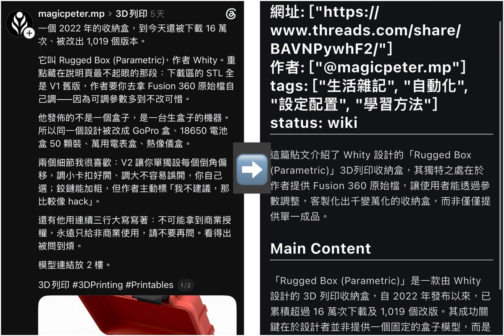
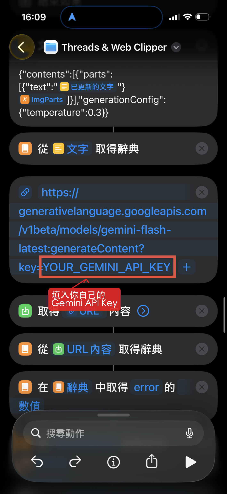
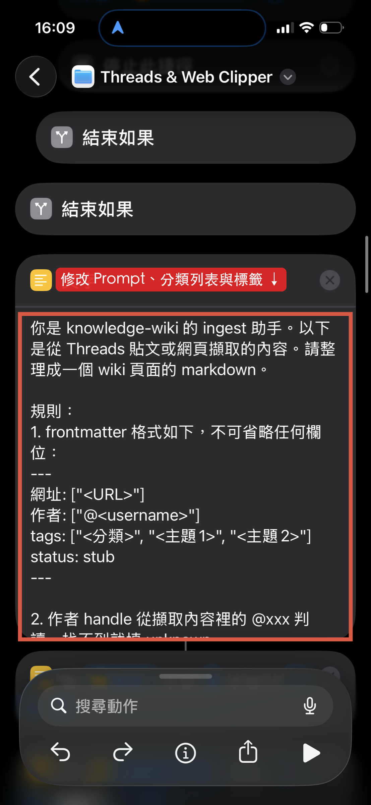
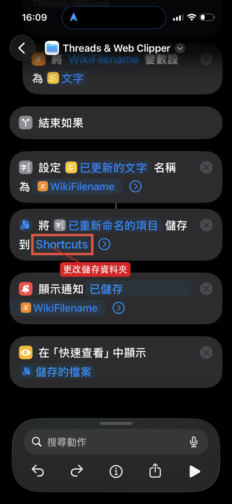

# Threads Clipper

> **v10 (2026-09-13)** — system prompt 與 thread-sieve 對齊：分類 tag 改為 24 類封閉清單並加入分類判斷提示；主題 tag 改為 2–4 個並採用 knowledge-wiki 的受控詞彙與格式規範；title 改用 thread-sieve 的標題規則與壞→好範例。

一個 iOS/macOS 捷徑，按分享鍵就能把 Threads 貼文或任何網頁轉成結構化的 markdown 筆記。

用 [Jina Reader](https://jina.ai/reader/) 抓網頁內容，丟給 Gemini 整理成帶 frontmatter、摘要、分類 tags 的 wiki 頁面，自動命名後存進指定資料夾。全程不碰鍵盤。

## 範例



## 功能

- **Threads 貼文 + 任何網頁**：部落格、HackMD、技術文章都能用
- **圖片 OCR**：Threads 貼文有附圖時會詢問是否讓 Gemini 讀取圖卡內容，圖表、示意圖裡的文字都會整進筆記
- **Threads 守門機制**：Threads 對需要登入的貼文會回傳首頁動態（HTTP 200），捷徑會偵測並中止，不會產出內容無關的筆記
- **自動分類與命名**：Gemini 根據內容判斷 tags 分類，並產出適配標題作為檔名

## 安裝

1. 下載 [`release/Threads Clipper.shortcut`](release/Threads%20Clipper.shortcut)
2. 在 iPhone/Mac 上打開檔案，點「加入捷徑」
3. 設定你自己的 Gemini API Key（見下方）

## 設定

### Gemini API Key

找到捷徑中呼叫 Gemini 的「URL」動作，網址長這樣：

```
https://generativelanguage.googleapis.com/v1beta/models/gemini-flash-latest:generateContent?key=YOUR_GEMINI_API_KEY
```

把 `YOUR_GEMINI_API_KEY` 換成你的 key。到 [Google AI Studio](https://aistudio.google.com/apikey) 免費申請。



### Prompt 與分類

捷徑裡最長的那個「文字」動作就是完整的 system prompt。裡面包含 frontmatter 格式規則、tags 分類清單、主題 tags、輸出格式與 OCR 指示。改成你自己的分類系統就好。



### 儲存位置

最後一個「儲存檔案」動作，預設存到 iCloud 的 `/Threads-Wiki/` 資料夾。你可以改成自己 Obsidian vault 的路徑，或打開「儲存前詢問」每次手動選資料夾。



## 使用方式

1. 在 Threads、Safari 或任何 app 裡按「分享」
2. 選「Threads Clipper」
3. 如果貼文有圖，會問你要不要 OCR
4. 幾秒後收到通知，筆記已存檔
5. 存完會跳出快速查看預覽

## 限制

- 貼文內提到的外部連結不會自動抓取，只記這篇本身的內容
- 圖片 OCR 目前只認 Threads CDN 的圖片（`scontent` 開頭），其他網站的內嵌圖片尚未支援
- 需要登入才能看的 Threads 貼文會被守門機制擋下（這是刻意的）

## 專案結構

```
├── README.md
├── docs/                                # 說明截圖
├── src/
│   └── Wiki-Pages-Writer.xml            # 捷徑的 XML 原始碼（可讀、可 diff）
└── release/
    └── Threads Clipper.shortcut    # 簽署好的捷徑檔（直接安裝用）
```

`src/` 裡的 XML 是用 Claude Code 手寫的 Apple Shortcuts plist，可以直接閱讀和修改。改完後用 macOS 內建工具重新簽署：

```bash
# XML → binary plist
python3 -c "
import plistlib
with open('src/Wiki-Pages-Writer.xml','rb') as f:
    pl = plistlib.load(f)
with open('src/unsigned.shortcut','wb') as f:
    plistlib.dump(pl, f, fmt=plistlib.FMT_BINARY)
"

# 簽署
shortcuts sign --mode anyone \
  --input src/unsigned.shortcut \
  --output 'release/Threads Clipper.shortcut'
```

## 相關專案

- [thread-sieve](https://github.com/hikarushane/thread-sieve)：批次處理 Threads 已儲存貼文，一次抓幾十篇、取消儲存、整理成筆記。適合定期清理儲存清單。Threads Clipper 則是看到當下就能順手記一篇。

## 授權

MIT License
